# 在 Cloudflare 上部署 BPB Panel
[这是什么？](https://github.com/bia-pain-bache/BPB-Worker-Panel)

一个能在 [Cloudflare](https://www.cloudflare.com) [Workers](https://workers.cloudflare.com/)/[Pages](https://pages.cloudflare.com/) 上运行的**代理服务端**，面板。旨在方便用户搭建[代理服务器](https://zh.wikipedia.org/wiki/%E4%BB%A3%E7%90%86%E6%9C%8D%E5%8A%A1%E5%99%A8)并[突破网络审查](https://zh.wikipedia.org/wiki/%E7%AA%81%E7%A0%B4%E7%BD%91%E7%BB%9C%E5%AE%A1%E6%9F%A5)。

::: tip :notebook: 比较 / 提示
它与 [EdgeTunnel](EdgeTunnel) 一样，都是做**代理**的。

需要说明一下，本文和 [EdgeTunnel](EdgeTunnel) 所用的步骤几乎相同，所以有些通用步骤会直接使用 [EdgeTunnel](EdgeTunnel) 的图片。~~绝对不是我太懒了~~
:::

::: warning :warning: 注意
[突破网络审查](https://zh.wikipedia.org/wiki/%E7%AA%81%E7%A0%B4%E7%BD%91%E7%BB%9C%E5%AE%A1%E6%9F%A5#%E4%B8%AD%E5%9B%BD%E5%A4%A7%E9%99%86) 本身也是违法行为，本教程仅供交流学习使用，使用造成的后果需由自己承担。
:::

[如何使用cloudflare结合BPB面板搭建免费节点](https://linux.do/t/topic/76059) （[Sunnnner](https://linux.do/u/Sunnnner), [LINUX DO](https://linux.do/)）

## 注册 Cloudflare 账号
::: danger :warning: 警告
使用[本教程](#)需要承担一定的风险，推荐使用`小号`来进行操作。
- Cloudflare 的[封号风险](https://www.cloudflare.com/zh-cn/terms)：`(j) use the Services to provide a virtual private network or other similar proxy services.`。
:::

::: tip :notebook: 提示
如果已经注册了 [Cloudflare](https://dash.cloudflare.com/sign-up) （小号）账号的可以直接去到 [#复制代码](#复制代码)。
:::

---

打开 [Cloudflare 注册链接](https://dash.cloudflare.com/sign-up)，填写好注册用的账号和密码，过一下人机验证，然后点击 `Sign up` 按钮。

Cloudflare 密码设置的规则如下：
- 至少 8 个字符
- 至少 1 个数字
- 至少 1 个特殊字符，例如 $、!、@、%、&
- 密码最前端和最末端不能有空格

至此，我们已经成功地创建了一个 Cloudflare 账号。[Cloudflare Dashboard](https://dash.cloudflare.com) 是主要的 Cloudflare 服务控制面板。创建成功后，一般会进入到如图所示的页面中。如果你看不懂**英文**，可以按图示所述调整页面语言为**简体中文**。一切就绪后，点击`左上角`的 Cloudflare 图标及文字就能返回到 Cloudflare 仪表盘。

*此时 Cloudflare 会往你注册时填的邮箱发送一封验证邮件，此时点击邮件中的验证链接即可验证账户（否则会无法使用部分功能）。*

## 复制代码
### 混淆 _worker.js 代码

:::tip :notebook: 提示

由于使用源 `worker.js` 代码或经广泛传播的混淆 `worker.js` 挂载到 Workers 上的话可能会报 `1101 Worker threw exception` 错误，所以你可以选择自己混淆 BPB Panel 的 `_worker.js` 代码，然后自己使用，报 1101 错误次数会减少。在这里也写一个教程。
:::

---

如果没有 GitHub 账号的话可以去[注册](https://github.com/signup)一个，在这里就不细说了。注册好后去到 [BPB-Worker-Panel 带混淆代码版](https://github.com/lu-lingyun/BPB-Worker-Panel/) 的 GitHub 仓库，点击 "Fork" 按钮然后点击 "Create Fork" 就 Fork 好了。 

完成下图所示步骤，点击 "I understand my workflows, go ahead and enable them" 按钮，打开 GitHub Actions。

然后在左侧找到 "Build and Deploy Worker"，点击后在右侧点击 "Run Workflow"，运行工作流进行混淆。

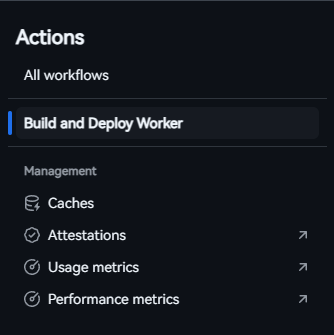

等待工作流完成后，返回仓库主页面，点击 `_worker.js` 文件，然后 Copy raw file。这样，你就获得了一份独属于你自己的独一无二的 `_worker.js` 代码。

**就像这样：**

### 使用 Workers 搭建
复制完 [#混淆 _worker.js 代码](#混淆-_workerjs-代码) 步骤中的 `_worker.js` 代码后，如果你选择使用 `Cloudflare Worker 方式部署`，即可直接去到 [#开始搭建/#使用 Workers 搭建](#使用-workers-搭建-1) 步骤完成部署。

### 使用 Pages 搭建
去到你在 [#混淆 _worker.js 代码](#混淆-_workerjs-代码) 步骤 Fork 的仓库，点击 `Download ZIP`，下载 `BPB-Worker-Panel-dev.zip`。

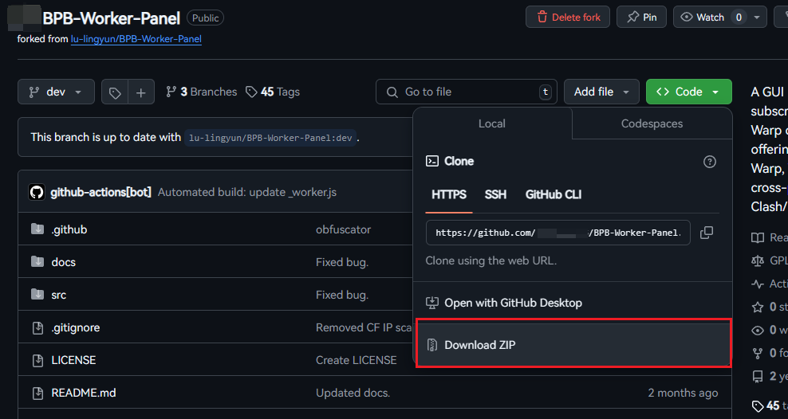

## 开始搭建
### 使用 Workers 搭建

Copy raw file 后，返回到 [Cloudflare Dashboard](https://dash.cloudflare.com)，在左侧列表中找到 `Workers 和 Pages` 并点击它。

在新的页面中点击 `创建 Worker`，并保持 Worker 名字为**系统推荐**的名字（推荐）或不含 `bpb` `panel` `bpbpanel` 等敏感字词（否则会直接 `1101`），点击右下角的 `部署`，等待部署成功后点击右上角的 `编辑代码`。

把在 [#复制代码](#复制代码) 部分得到的 _worker.js 的代码**粘贴**到编辑器中，最后点击 `部署` 按钮即可把 EdgeTunnel 部署到 `Cloudflare 全球网络` 上。点击左上角（你的项目名）即可返回 Worker 控制台。

---
---

### 使用 Pages 搭建
给[仓库1](https://github.com/bia-pain-bache/BPB-Worker-Panel) 和 [仓库2](https://github.com/lu-lingyun/BPB-Worker-Panel/) 点上一个`star`。

来到 [Cloudflare Dashboard](https://dash.cloudflare.com)，在左侧列表中找到 `Workers 和 Pages` 并点击它，上传资产，创建一个 Pages。

Pages 的名称请参阅 [#使用 Workers 搭建](#使用-workers-搭建) 部分。上传的文件为在 [#复制代码/#使用 Pages 搭建](#使用-pages-搭建)下载的 `BPB-Worker-Panel-dev.zip`。然后点击 `部署站点` 即可将 BPB Panel 部署到 Cloudflare Pages 上。点击 `继续处理项目` 即可返回到 Page 控制台。**先不要删除 `BPB-Worker-Panel-dev.zip`**。

## 配置 BPB Panel
### 配置 UUID
:::tip :notebook: 提示
由于 `Workers` 和 `Pages` 的大部分配置步骤是相同的，所以这里以 `Worker` 的方式配置 `BPB Panel`。
:::

---

在配置 [UUID](https://zh.wikipedia.org/wiki/%E9%80%9A%E7%94%A8%E5%94%AF%E4%B8%80%E8%AF%86%E5%88%AB%E7%A0%81) 之前，如果你访问了项目，则会提示 `⚠️ Please set UUID and Trojan password first. Please visit here to generate them.`。因为在使用 BPB Panel 前需要配置 `UUID` 和 `TROJAN_PASS`。

访问你的 Worker 项目 URL，当出现 `Something went wrong!` 时代表你在 [#混淆 _worker.js 代码](#混淆-_workerjs-代码) 的结果是成功的。

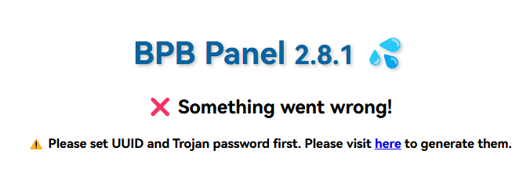

点击 `here`，将会打开 `UUID` `TROJAN_PASS` 生成界面。点击右边的 `📋` 即可将它们复制到剪贴板。然后进入你的 `Worker`/`Page` 控制台，进行如图所示的步骤添加所需的变量即可。

1. **`UUID`**
- 类型：文本
- 变量名称：`UUID`
- 值：在 `Secrets generator` 生成的 `Random UUID` 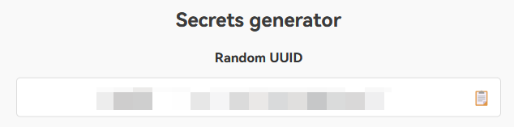

2. **`Trojan Password`**
- 类型：文本
- 变量名称：`TROJAN_PASS`
- 值：在 `Secrets generator` 生成的 `Random Trojan Password` 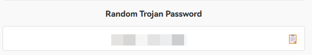

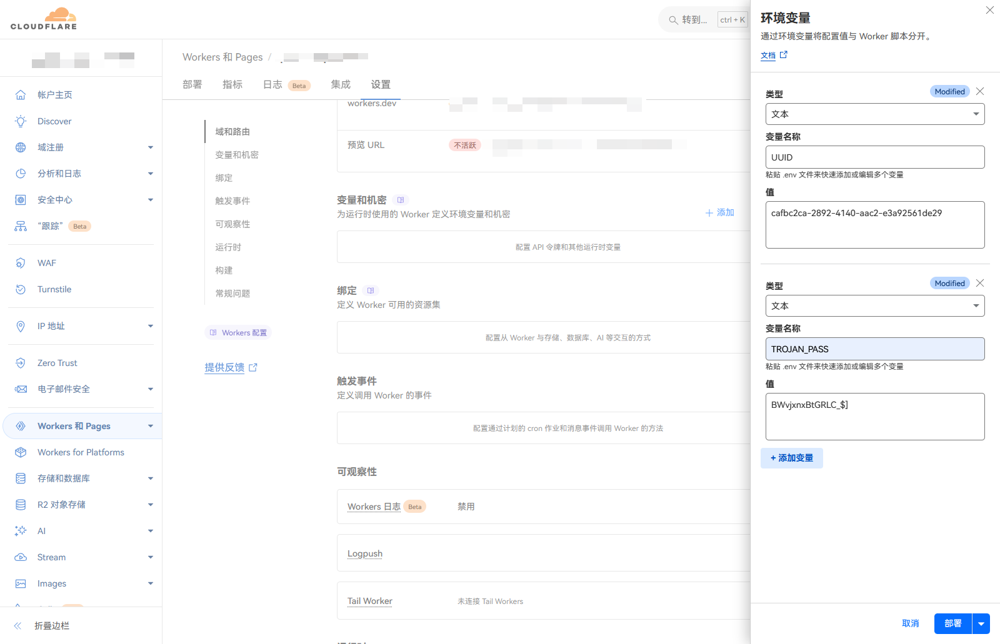

:::warning :warning: 注意
- **一开始使用 Workers 方式部署 BPB Panel 的可以直接点击 `部署` 按钮，等待部署完毕即可将创建的 UUID 应用到 Worker 上。**
- **一开始使用 Pages 方式部署 BPB Panel 的需要先点击 `保存` 按钮，然后返回`部署`页面，点击右上角的`创建部署`，重新上传一遍在 GitHub 下载的 `BPB-Worker-Panel-dev.zip`。然后点击`保存并部署`才可将创建的 UUID 和 TROJAN_PASS 变量应用到 Page 上。**
:::

### 配置 Cloudflare KV
:::tip :notebook: 何为 Cloudflare KV？
[Cloudflare KV](https://www.cloudflare.com/zh-cn/developer-platform/products/workers-kv/) 是一种存储工具，一般利用于非频繁更改的参考数据或资源。在配置 `EdgeTunnel` 时用来存储 `优选 IP 信息`。
> 利用我们的无服务器键值存储扩展应用的功能。Workers KV 提供安全的低延迟键值存储，覆盖全球 330 地点。自动扩展支持服务数十或数百万用户的应用。
:::

使用 BPB Panel 前需要配置 Cloudflare KV ，因为 BPB Panel 需要保存相关设置。如果不添加 KV，将会提示 `Something went wrong`。

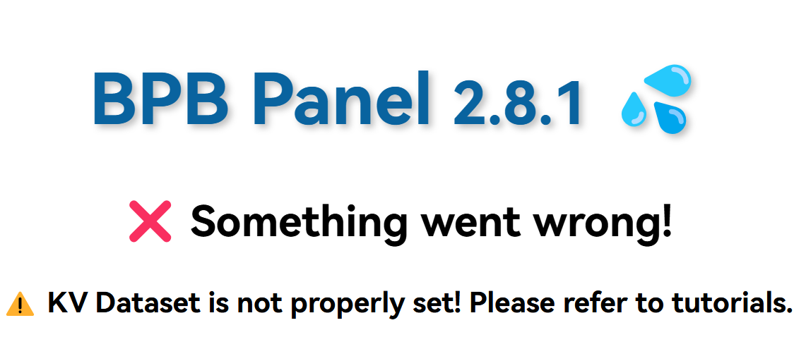

在 [Cloudflare Dashboard](https://dash.cloudflare.com) 中的左侧列表中打开 `存储和数据库` 旁边的小倒三角，进入 KV 配置页面。

点击右边的 `创建` 按钮，`命名空间名称` 可以填任意字符。完成后点击 `添加`，这样就获得了一个 KV 存储空间。

::: warning :warning: 注意
设置的 KV 名称不能重复，且请勿使用**原有的且被其他 Workers/Pages 使用中**的如 `EdgeTunnel` 的 KV 来配置 BPB-Panel。
:::

返回到 `Workers 和 Pages` 页面，点击你创建的 `Worker`/`Page`，到`设置`页面，找到`绑定`，点击 `添加`，进行如图所示的步骤即可。

- 变量名称：`bpb`
- KV 命名空间：刚刚创建的 KV 的名称

::: warning :warning: 注意
- **一开始使用 Workers 方式部署 BPB Panel 的可以直接点击 `部署` 按钮，等待部署完毕即可将创建的 KV 应用到 Worker 上。**
- **一开始使用 Pages 方式部署 BPB Panel 的需要先点击 `保存` 按钮，然后返回`部署`页面，点击右上角的`创建部署`，重新上传一遍在 GitHub 下载的 main.zip。然后点击`保存并部署`才可将创建的 KV 应用到 Page 上。**
:::

### 配置自定义域名
::: warning :warning: 信息
受 [GFW](https://zh.wikipedia.org/wiki/%E9%98%B2%E7%81%AB%E9%95%BF%E5%9F%8E) 的影响，国内各地已无法正常访问 `.workers.dev` 域名；有一些地区无法正常访问 `pages.dev` 域名。如果你使用 `Workers` 方式搭建 EdgeTunnel 的话，建议使用**自定义域名**。
:::

::: tip :notebook: 提示
接下来的步骤需要一个 **已托管在 Cloudflare 的域名**。如果你还没有域名，可以参照 [技术怕爬爬虾](https://space.bilibili.com/316183842) 的 [[2024最新免费域名教程，可托管CF，零失败率，解决所有坑点。]](https://www.bilibili.com/video/BV1by411B7Ko) 视频获取免费的 `us.kg` 和 `cloudns.be` 等域名。

至于怎么把域名托管到 Cloudflare 上，同样可以参照上面的视频。这里同样不多说，以已托管的域名为例子。
:::

在你的 `Worker`/`Page` 控制台的`设置`页面，在`域和路由`中点击 `添加` 按钮，添加自定义域名。如图所示。

至此，你已完成在控制台需要配置的基础任务。

## 使用 BPB Panel
访问你搭建的 BPB Panel URL（绑定有自定义域名的优先使用自定义域名，没有的如果是 `Worker` 的话建议参照 [#配置自定义域名](#配置自定义域名) 绑定一个自定义域名。`Pages` 的话能绑尽量绑，这个看你的地区情况。

*假设这个自定义域名为 `bpb.test.us.kg`*

### 配置密码
**这里的`密码`指的不是上面的变量`UUID`。**

用浏览器访问 `bpb.test.us.kg`，此时的访问页面如果为 Cloudflare 的 `Speed Test`，就代表你成功搭建了 BPB Panel了🎉🎉🎉。恭喜你。然后在链接处加上 `/panel`。这时需要访问的链接就是 `bpb.test.us.kg/panel`，这将进入 BPB Panel 的 后台面板。当你第一次进入的时候，它将让你设置一个新的密码。请确保你一定能记住这个密码。

BPB Panel 密码设置的规则如下：
- 至少 8 个**字符**
- 至少 1 个**数字**
- 至少 1 个**大写字母**

创建完密码后，你就可以开始真正地使用 BPB Panel 了。🎉🎉🎉再次恭喜你🎉🎉🎉。

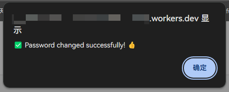

下次进入面板时，需要使用 `/login`。此时的访问链接就是 `bpb.test.us.kg/login`，这将会让你输入密码才能进入 BPB Panel 后台，密码就是你第一次进入 BPB Panel 后台时设置的密码。

::: tip :notebook: 找回密码
如果你忘记了你设置的是什么密码，只需要查看 KV 中保存的内容即可知道密码。

点击 `KV` ，如果你的 KV 名不叫 `KV` ，只需点击和图片相同的地方即可。

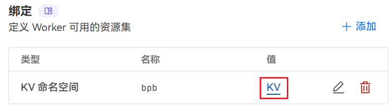

**`pwd` 就是你的 BPB Panel 后台密码。**
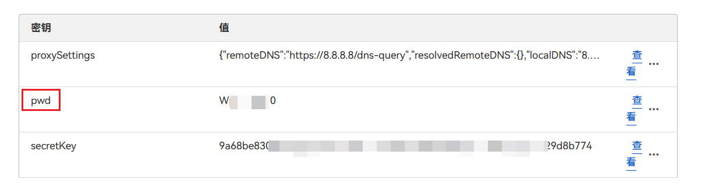
:::

### 获取订阅信息
进入你的 BPB Panel URL，登录。往下滑，找到 `FULL NORMAL SUB`。

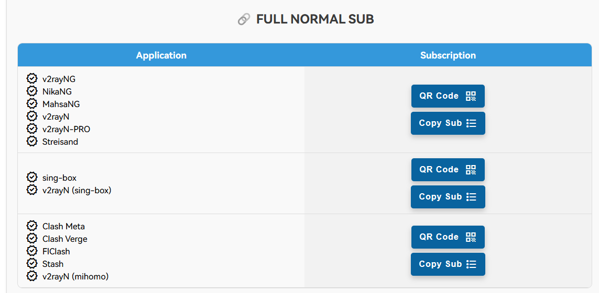

如果需要订阅进 `Clash Verge`/`Meta`/`For Windows` 的，就可以用第三个 `Copy Sub` 按钮来获取订阅链接，此时的订阅链接仅适合 Clash 系列，链接会自动复制到剪贴板。

如果需要订阅进 `V2rayN` 等代理软件，就可以用第一个 `Copy Sub` 按钮来获取订阅链接，此时的订阅链接仅适合 V2rayN 系列或其他软件，链接会自动复制到剪贴板。

Copy Sub 按钮：

获取订阅链接成功：

成功在 Clash Verge 上获取到配置文件：
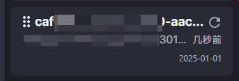

其他订阅链接，请自行探索。