# 在 Cloudflare 上部署 EdgeTunnel
[这是什么？](https://github.com/cmliu/edgetunnel)

一个能在 [Cloudflare](https://www.cloudflare.com) [Workers](https://workers.cloudflare.com/)/[Pages](https://pages.cloudflare.com/) 上运行的**代理服务端**。旨在方便用户搭建[代理服务器](https://zh.wikipedia.org/wiki/%E4%BB%A3%E7%90%86%E6%9C%8D%E5%8A%A1%E5%99%A8)并[突破网络审查](https://zh.wikipedia.org/wiki/%E7%AA%81%E7%A0%B4%E7%BD%91%E7%BB%9C%E5%AE%A1%E6%9F%A5)。

::: warning :warning: 注意
[突破网络审查](https://zh.wikipedia.org/wiki/%E7%AA%81%E7%A0%B4%E7%BD%91%E7%BB%9C%E5%AE%A1%E6%9F%A5#%E4%B8%AD%E5%9B%BD%E5%A4%A7%E9%99%86) 本身也是违法行为，本教程仅供交流学习使用，使用造成的后果需由自己承担。
:::

<iframe width="560" height="315" src="https://www.youtube.com/embed/tKe9xUuFODA?si=XdaRWAHyTbF1KMbg&amp;start=105" title="YouTube video player" frameborder="0" allow="accelerometer; autoplay; clipboard-write; encrypted-media; gyroscope; picture-in-picture; web-share" referrerpolicy="strict-origin-when-cross-origin" allowfullscreen></iframe>

## 注册 Cloudflare 账号
::: danger :warning: 警告
使用[本教程](#)需要承担一定的风险，推荐使用`小号`来进行操作。
- Cloudflare 的[封号风险](https://www.cloudflare.com/zh-cn/terms)：`(j) use the Services to provide a virtual private network or other similar proxy services.`。
:::

::: tip :notebook: 提示
如果已经注册了 [Cloudflare](https://dash.cloudflare.com/sign-up) （小号）账号的可以直接去到 [#复制代码](#复制代码)。
:::

---

打开 [Cloudflare 注册链接](https://dash.cloudflare.com/sign-up)，填写好注册用的账号和密码，过一下人机验证，然后点击 `Sign up` 按钮。

Cloudflare 密码设置的规则如下：
- 至少 8 个字符
- 至少 1 个数字
- 至少 1 个特殊字符，例如 $、!、@、%、&
- 密码最前端和最末端不能有空格

至此，我们已经成功地创建了一个 Cloudflare 账号。[Cloudflare Dashboard](https://dash.cloudflare.com) 是主要的 Cloudflare 服务控制面板。创建成功后，一般会进入到如图所示的页面中。如果你看不懂**英文**，可以按图示所述调整页面语言为**简体中文**。一切就绪后，点击`左上角`的 Cloudflare 图标及文字就能返回到 Cloudflare 仪表盘。

*此时 Cloudflare 会往你注册时填的邮箱发送一封验证邮件，此时点击邮件中的验证链接即可验证账户（否则会无法使用部分功能）。*

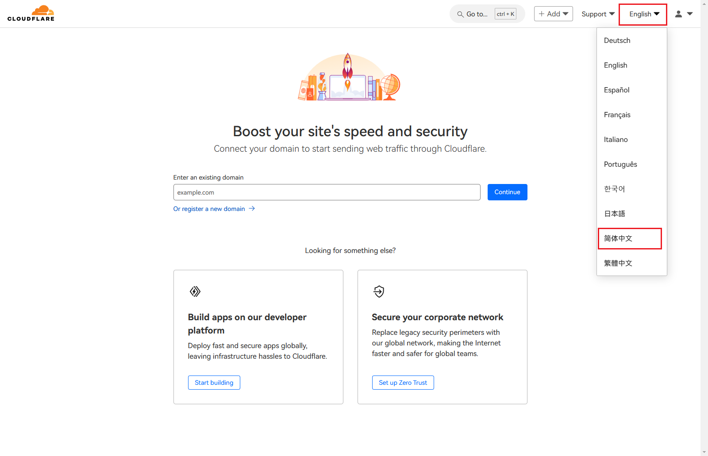

## 复制代码
### 使用 Workers 搭建
首先去到由 [CMLiussss](https://www.youtube.com/@CMLiussss) 大佬开发的基于原作者 [zizifn](https://github.com/zizifn) 开发的 [新版 EdgeTunnel 的 GitHub 仓库](https://github.com/cmliu/edgetunnel)。

点击仓库中的 `_worker.js` 或直接打开[该链接](https://github.com/cmliu/edgetunnel/blob/main/_worker.js)。点击`复制`图标，如图所示。

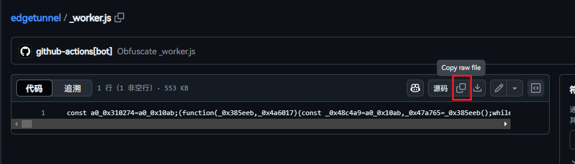

### 使用 Pages 搭建
需要下载 [edgetunnel-main.zip](https://github.com/cmliu/edgetunnel/archive/refs/heads/main.zip)（里面也有_worker.js），但是后面会讲到，下了的话先不要删掉。

---

其他：

混淆 _worker.js 代码

:::tip :notebook: 提示

由于使用源 `worker.js` 代码或经广泛传播的混淆 `worker.js` 挂载到 Workers 上的话可能会报 `1101 Worker threw exception` 错误，所以你可以选择自己混淆 EdgeTunnel 的 `_worker.js` 代码，然后自己使用，报 1101 错误次数会减少。在这里也写一个教程。
:::

---

如果没有 GitHub 账号的话可以去[注册](https://github.com/signup)一个，在这里就不细说了。注册好后去到 [EdgeTunnel](https://github.com/cmliu/edgetunnel) 的 GitHub 仓库，点击 "Fork" 按钮然后点击 "Create Fork" 就 Fork 好了。 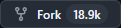
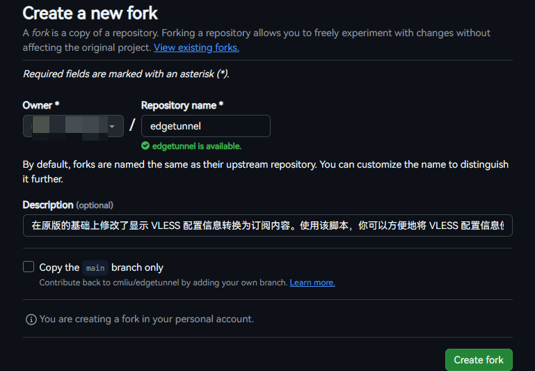

完成下图所示步骤，点击 "I understand my workflows, go ahead and enable them" 按钮，打开 GitHub Actions。

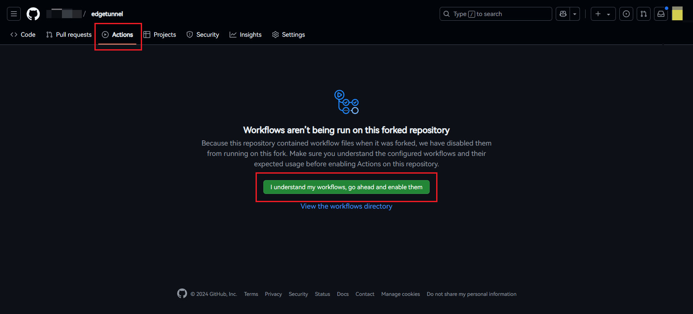

然后在左侧找到 "Obfuscate and Commit"，点击后在右侧点击 "Run Workflow"，运行工作流进行混淆。

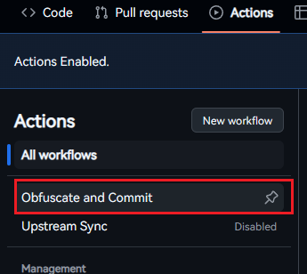 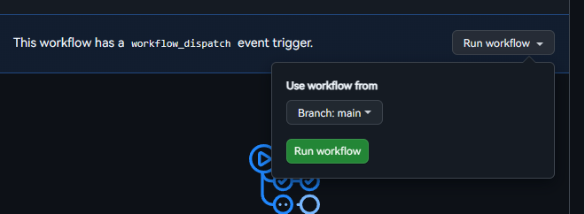

等待工作流完成后，返回仓库主页面，点击 `_worker.js` 文件，然后 Copy raw file。这样，你就获得了一份独属于你自己的独一无二的 `_worker.js` 代码。
# *End*

## 开始搭建
### 使用 Workers 搭建

Copy raw file 后，返回到 [Cloudflare Dashboard](https://dash.cloudflare.com)，在左侧列表中找到 `Workers 和 Pages` 并点击它。

在新的页面中点击 `创建 Worker`，并保持 Worker 名字为**系统推荐**的名字（推荐）或不含 `bpb` `edge` `edgetunnel` 等敏感字词（否则会直接 `1101`），点击右下角的 `部署`，等待部署成功后点击右上角的 `编辑代码`。

把在 [#复制代码](#复制代码) 部分得到的 _worker.js 的代码**粘贴**到编辑器中，最后点击 `部署` 按钮即可把 EdgeTunnel 部署到 `Cloudflare 全球网络` 上。点击左上角（你的项目名）即可返回 Worker 控制台。

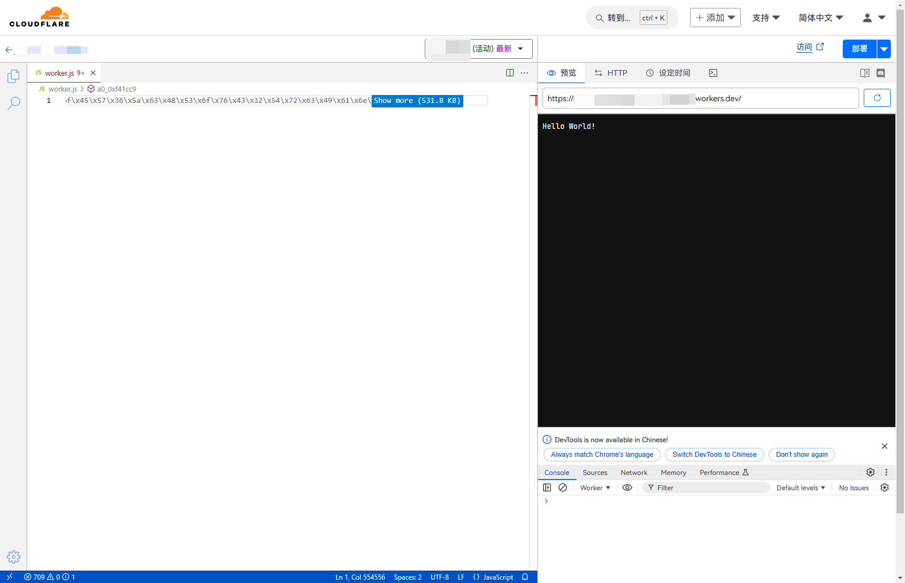

---
---

### 使用 Pages 搭建
给[仓库](https://cmliu/edgetunnel)点上一个`star`并下载 [edgetunnel-main.zip](https://github.com/cmliu/edgetunnel/archive/refs/heads/main.zip) 。

下载后来到 [Cloudflare Dashboard](https://dash.cloudflare.com)，在左侧列表中找到 `Workers 和 Pages` 并点击它，上传资产，创建一个 Pages。

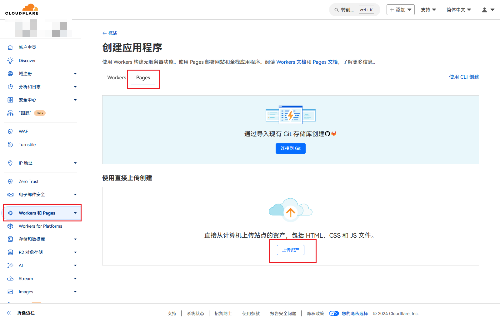

Pages 的名称请参阅 [#使用 Workers 搭建](#使用-workers-搭建) 部分。上传的文件为刚下载的 [edgetunnel-main.zip](https://github.com/cmliu/edgetunnel/archive/refs/heads/main.zip)。然后点击 `部署站点` 即可将 EdgeTunnel 部署到 Cloudflare Pages 上。点击 `继续处理项目` 即可返回到 Page 控制台。**先不要删除 edgetunnel-main.zip**。

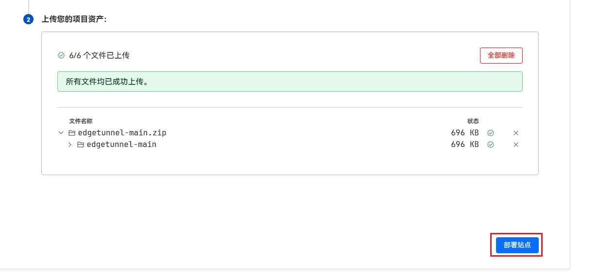

## 配置 EdgeTunnel
### 配置 UUID
:::tip :notebook: 提示
由于 `Workers` 和 `Pages` 的大部分配置步骤是相同的，所以这里以 `Worker` 的方式配置 `EdgeTunnel`。
:::

---

在配置 [UUID](https://zh.wikipedia.org/wiki/%E9%80%9A%E7%94%A8%E5%94%AF%E4%B8%80%E8%AF%86%E5%88%AB%E7%A0%81) 之前，如果你访问了项目，则会提示 `请设置你的UUID变量，或尝试重试部署，检查变量是否生效？`。因为在使用 EdgeTunnel 前需要配置 UUID。

进入你的 `Worker`/`Page` 控制台，进行如图所示的步骤即可。

- 类型：文本
- 变量名称：`UUID`
- 值：任意内容

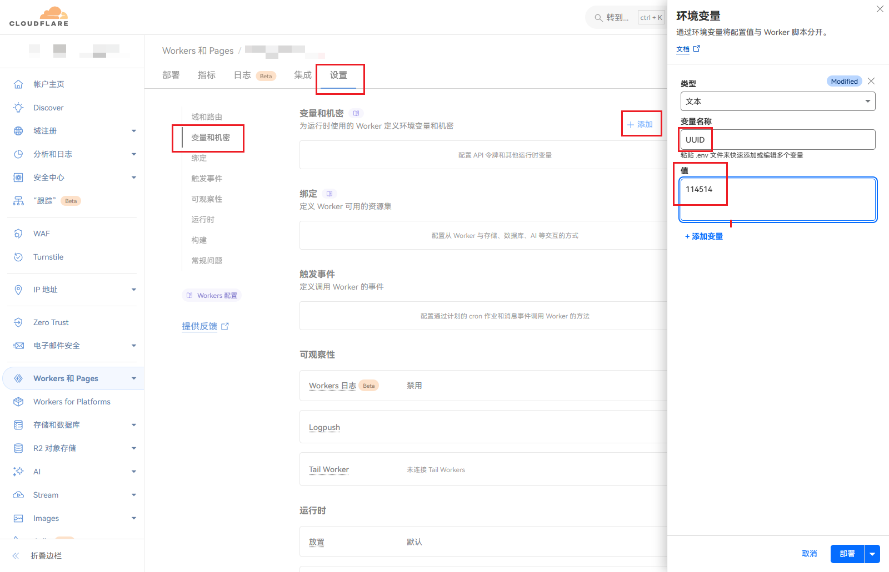

:::warning :warning: 注意
- **一开始使用 Workers 方式部署 EdgeTunnel 的可以直接点击 `部署` 按钮，等待部署完毕即可将创建的 UUID 应用到 Worker 上。**
- **一开始使用 Pages 方式部署 EdgeTunnel 的需要先点击 `保存` 按钮，然后返回`部署`页面，点击右上角的`创建部署`，重新上传一遍在 GitHub 下载的 edgetunnel-main.zip。然后点击`保存并部署`才可将创建的 UUID 应用到 Page 上。**
:::

### 配置 Cloudflare KV
:::tip :notebook: 提示
如果你对 [优选 IP](https://github.com/XIU2/CloudflareSpeedTest) 不感兴趣的话，可以直接跳转到 [#使用 Edgetunnel](#使用-edgetunnel) 部分。
:::

正如 [XIU2](https://github.com/XIU2) 在 [CloudflareSpeedTest 仓库](https://github.com/XIU2/CloudflareSpeedTest) 所说，

> 国外很多网站都在使用 Cloudflare CDN，但分配给中国内地访客的 IP 并不友好（延迟高、丢包多、速度慢）。
虽然 Cloudflare 公开了所有 IP 段 ，但想要在这么多 IP 中找到适合自己的，怕是要累死，于是就有了这个软件。

在中国大陆要想获得最优的 CDN IP，需要自己优选 IP，获得最优节点。

**怎么获得最优 IP，这里就不多说了。可以选择如 [CloudflareSpeedTest](https://github.com/XIU2/CloudflareSpeedTest) 这种测试工具获得最优 IP。这里主要讲添加 Cloudflare KV。**

:::tip :notebook: 何为 Cloudflare KV？
[Cloudflare KV](https://www.cloudflare.com/zh-cn/developer-platform/products/workers-kv/) 是一种存储工具，一般利用于非频繁更改的参考数据或资源。在配置 `EdgeTunnel` 时用来存储 `优选 IP 信息`。
> 利用我们的无服务器键值存储扩展应用的功能。Workers KV 提供安全的低延迟键值存储，覆盖全球 330 地点。自动扩展支持服务数十或数百万用户的应用。
:::

---

在 [Cloudflare Dashboard](https://dash.cloudflare.com) 中的左侧列表中打开 `存储和数据库` 旁边的小倒三角，进入 KV 配置页面。

点击右边的 `创建` 按钮，`命名空间名称` 可以填任意字符。完成后点击 `添加`，这样就获得了一个 KV 存储空间。

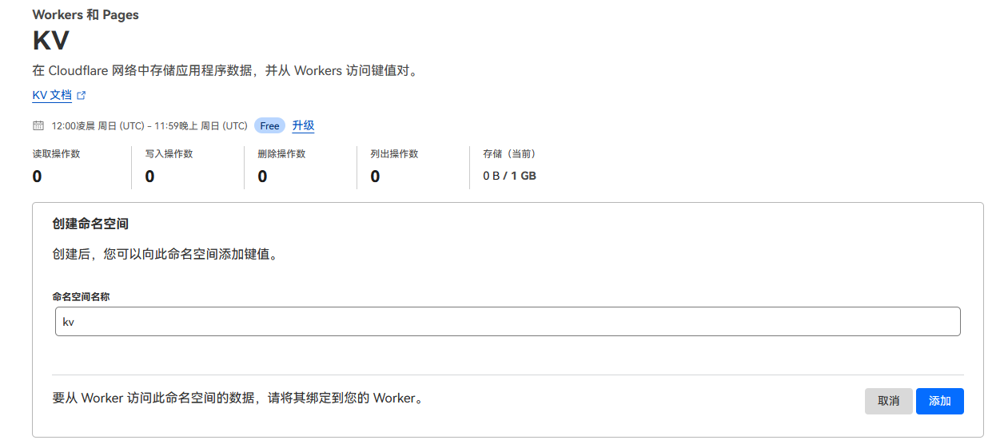

返回到 `Workers 和 Pages` 页面，点击你创建的 `Worker`/`Page`，到`设置`页面，找到`绑定`，点击 `添加`，进行如图所示的步骤即可。

- 变量名称：`KV`
- KV 命名空间：刚刚创建的 KV 的名称

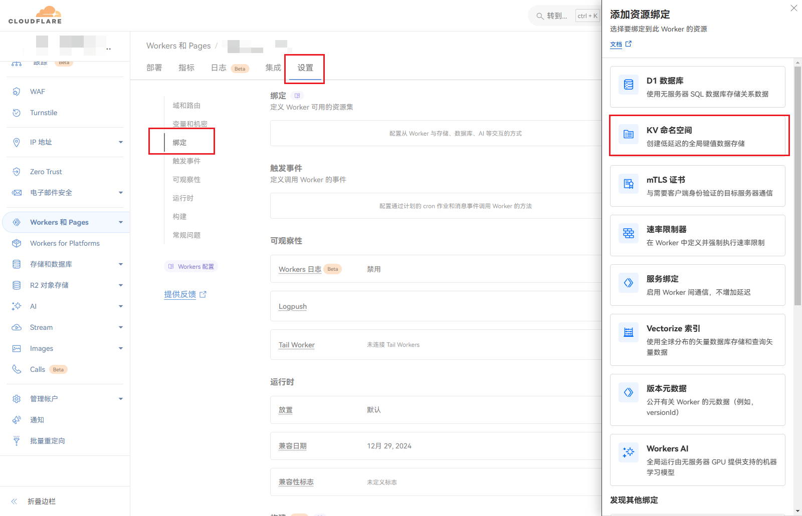

::: warning :warning: 注意
- **一开始使用 Workers 方式部署 EdgeTunnel 的可以直接点击 `部署` 按钮，等待部署完毕即可将创建的 KV 应用到 Worker 上。**
- **一开始使用 Pages 方式部署 EdgeTunnel 的需要先点击 `保存` 按钮，然后返回`部署`页面，点击右上角的`创建部署`，重新上传一遍在 GitHub 下载的 edgetunnel-main.zip。然后点击`保存并部署`才可将创建的 KV 应用到 Page 上。**
:::

### 配置自定义域名
::: warning :warning: 信息
受 [GFW](https://zh.wikipedia.org/wiki/%E9%98%B2%E7%81%AB%E9%95%BF%E5%9F%8E) 的影响，国内各地已无法正常访问 `.workers.dev` 域名；有一些地区无法正常访问 `pages.dev` 域名。如果你使用 `Workers` 方式搭建 EdgeTunnel 的话，建议使用**自定义域名**。
:::

::: tip :notebook: 提示
接下来的步骤需要一个 **已托管在 Cloudflare 的域名**。如果你还没有域名，可以参照 [技术怕爬爬虾](https://space.bilibili.com/316183842) 的 [[2024最新免费域名教程，可托管CF，零失败率，解决所有坑点。]](https://www.bilibili.com/video/BV1by411B7Ko) 视频获取免费的 `us.kg` 和 `cloudns.be` 等域名。

至于怎么把域名托管到 Cloudflare 上，同样可以参照上面的视频。这里同样不多说，以已托管的域名为例子。
:::

在你的 `Worker`/`Page` 控制台的`设置`页面，在`域和路由`中点击 `添加` 按钮，添加自定义域名。如图所示。

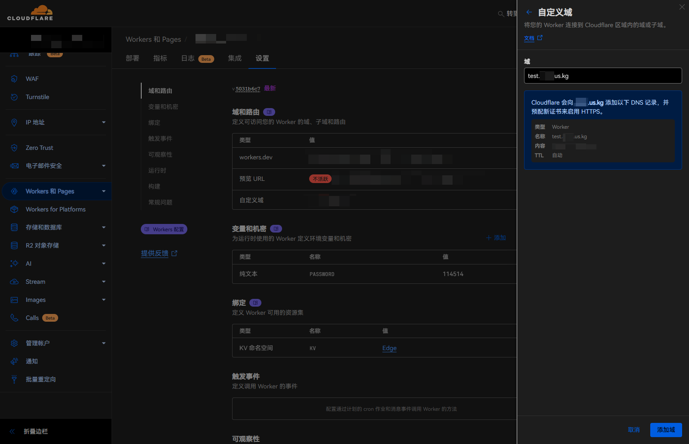

至此，你已完成在控制台需要配置的基础任务。

## 使用 EdgeTunnel
### 获取订阅信息
访问你搭建的 EdgeTunnel URL（绑定有自定义域名的优先使用自定义域名，没有的如果是 `Worker` 的话建议参照 [#配置自定义域名](#配置自定义域名) 绑定一个自定义域名。`Pages` 的话能绑尽量绑，这个看你的地区情况。

*假设这个自定义域名为 `edge.test.us.kg`*

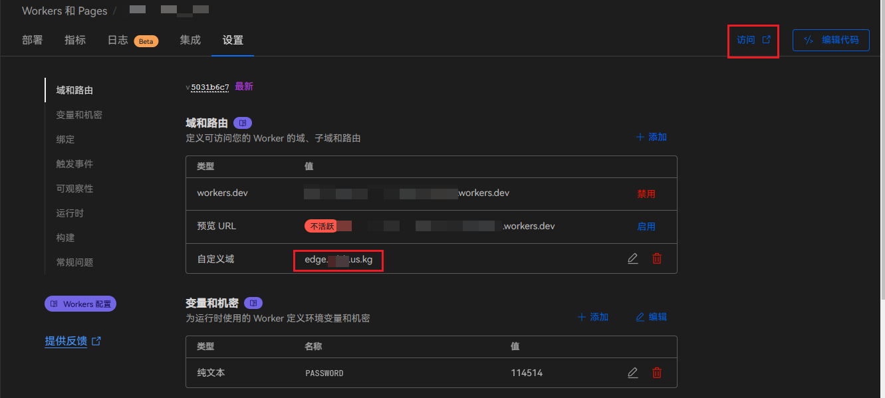

用浏览器访问 `edge.test.us.kg`，然后在链接处加上在 [#配置 UUID](#配置-uuid) 时添加的 UUID（假设是 `114514`）。这时需要访问的链接就是 `edge.test.us.kg/114514`。然后，相应的页面会告诉你一些常用的代理软件的订阅链接（如下图）。

比如需要订阅进 `Clash Verge`/`Meta`/`For Windows` 的，就可以用 `https://edge.test.us.kg/114514?clash` 来订阅。

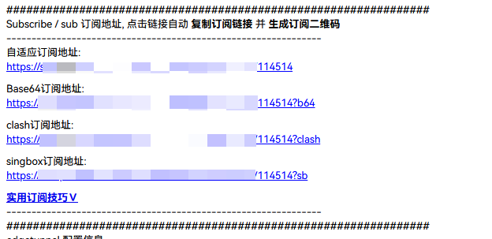

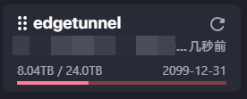

其他订阅链接，请自行探索。